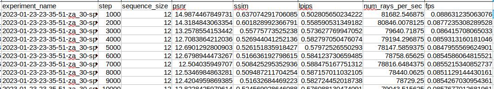
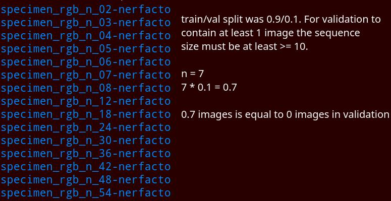
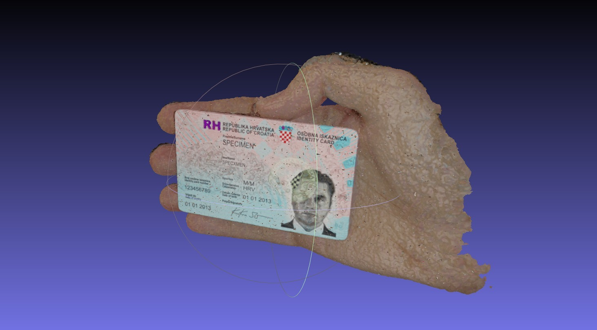
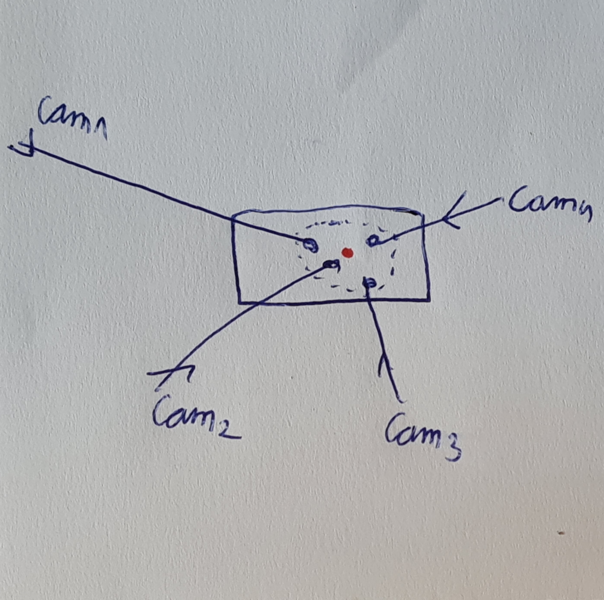
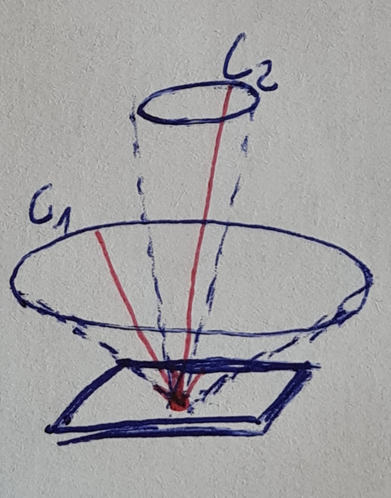

# NeRF (Neural Radiance Fields) research


## Log

- [ ] run mutiple experiments with same settings to examine how the intial seed impacts the training process
  - [ ] write concrete average time for training
- [ ] evaluate multiple models (different amount of training, different hyperparameters...) trained on the same scene
  - [ ] research which hyperparameters make most sense to play with
  - [ ] script should render multiple novel views
    - [ ] programmatically render multiple novel views. How do I programmatically create a camera path? Ideally, the camera path should go in a circle (radius=r) while the point of view is fixed on the id document. Then the camera should come closer to the id document and create another circle (radius=r).
    - [ ] for each novel view, try to come up with a metric which says how "novel" the view really is. For example, the novel view which is close to the existing frames isn't so novel.
- [ ] compare how lack of segmentation masks affects NeRF's results
  - [ ] reduce number of frames (90%, 80% ... 10%, ..., 5 images, 3 images, 2 images, 1 image) and make sure to always include last and first frame
- [ ] check how mistakes in segmentation affect the results
  - [ ] create 5 frames, 1 has wrong segmentation (corner of the id document)
  - [ ] check how do results look around the view which coresponds to that frame
- [ ] find a way to cut off material whose z depth is larger than the z depth of the id document (cut off everything that's in front of the id document)
- [ ] find out how efficient the process of creating new images is. How much compute time is needed to generate X amount of new images from Y amount of id cards
  - [ ] for start, use 3 video footages
  - [ ] export 3 colmaps
  - [ ] train 3 models
  - [ ] generate novel views
- [ ] introduce style variability to generate new type of image (for example, change the text of person’s name, change person’s face…)
  - [ ] check out how to embed information into nerfs https://distill.pub/2018/feature-wise-transformations/

#### 2023-02-28:

- [x] find sensible amount of frames for rgb scene: it's about ~ 55 continuous frames
  - [ ] check if evaluation can be skipped when training (self.eval_iteration(step))
- [x] compare results for different amount of training steps:
  - optimal number of training step is between 10_000 and 30_000 for nerfacto model which uses default optimizing settings
  - step size 10_000 compared to 30_000 has similar structural composition but image details were a bit worse
  - corners of the id document are better shaped at the step size 30_000  
- [x] fixed viewer which had hardcoded path
- [x] added ability to use arbitrary train/test indices/images via the `split_indices.json` file
- [x] added support for finetuning the model on smaller sequence size by remembering the initial training size

#### 2023-01-27:

- done image rendering for novel views for most models. The total number of models is the product of sample_size {12, ..., 54} x step_iter {0, ..., 10_000, ..., 40_000}. For each model, I rendered sequences (9 images) for 4 different camera paths. The conclusions are as follows:
- the most significant and essential parameter is the size of the sequence. The difference between the sequence size of n=40 and n=56 is huge. Images for n=40 are much worse than n=56.It is possible that it because of the seed, but all sizes n<40 give practically useless images, at least for the particular scene I currently use. I think that the small `n` hurts COLMAP rather than NeRF, but I still have to check that
- [] try some methods other than COLMAP to create a pointcloud from a sequence
- `step` (number of iterations, which I said should be n=30_000) gave surprisingly good results for n=10_000 as well. The difference between step=10_000 and step=30_000 is almost minimal, especially in the area of ​​the personal document and hand. Image details are slightly better for n=30_000, but definitely not significantly.

#### 2023-01-26:

- [x] caculate approximate number of minutes for training:
- [x] train the model on RGB images but use subset of sequences (n={12,18,24,30,36,42,48,54} out of 60 frames)
- [x] create a script which evaluates trained models:
  - [ ] save a detailed context for each result (config of the model, evaluation time)
  - [x] (PeakSignalNoiseRatio, structural_similarity_index_measure, LearnedPerceptualImagePatchSimilarity, num_rays_per_sec, fps)
  - [x] to csv
- Warning: default train/eval split is 0.9 which means that the sequence must contain at least 10 images!
- [x] caculate COLMAP minimum amount of frames: it works with only 2 frames but results might be bad
- [x] create multiple camera paths: on path, outside of path, inside of path to evaluate different results




#### 2023-01-17:

- [x] create a script which will subset number of images
- [x] export mesh to blender and view it




#### 2023-01-12:

- [x] train the model on RGB images, then finetune on segmentation
- [x] create wrap train script [](nerfstudio/scripts/train_wrap.py)
  - [x] automatically saves models every N training steps
  - [x] log the train time
  - [x] train multiple models (grid of parameters)
  - [x] support segmentation finetuning
- [x] evaluate multiple models (different amount of training, different hyperparameters...) trained on the same scene
  - [x] create better config defaults
  - [x] automatize segmentation finetuning
  - [x] automatize multiple architecture training


#### 2023-01-04:

- Idea: don't use COLMAP's mask region. Simply further train the network on segmeted video.
- COLMAP mask regions:
  - Mask image regions (--colmap_feature_extractor_kwargs "\-\-ImageReader.mask_path data/specimen_hand_mask/images")
  - COLMAP supports masking of keypoints during feature extraction by passing a mask_path to a folder with image masks. For a given image, the corresponding mask must have the same sub-path below this root as the image has below image_path. The filename must be equal, aside from the added extension .png. For example, for an image image_path/abc/012.jpg, the mask would be mask_path/abc/012.jpg.png. No features will be extracted in regions, where the mask image is black (pixel intensity value 0 in grayscale).
- how to open Colmap model? `Import Model -> sparse/0`

2022-12-15:
- [x] train a nerf on a scene. Then freeze the MLP and fine-tune it by using NEW semantic segmentation images. The only thing you have to adjust is color, the depth can stay the same
- [x] trained nerfacto on my student card in multiple conditions: small, med, large video duration, shaky camera
- results playlist https://www.youtube.com/watch?v=BGwiesxWRcs&list=PL9LfBxpj0EM6GpKXLqxVCV1wuc0GFtD6k&index=2
- StyleNeRF: https://jiataogu.me/style_nerf/
  - gpu: NVIDIA TITAN Xp
  - colmap video to cloud point extraction => 15min
  - nerfacto training: 45 min (30 000 steps)
  - inference: 10 seconds for one frame (1920x1080)


2022-12-12:
- it's always better to use videos (even if they are <1 sec) because 30fps of 1 second is 30 images
- [x] caculate conversion of video to colmap
- [x] caculate training time
- downsamples of ns-process-data aren't used for anything. Is downsamples used for anything?

2022-11-17:

- note taking and complete understanding of Mip-NeRF paper https://github.com/google/mipnerf
- setup Docker image which installs everything needed to run the [nerfstudio](https://github.com/nerfstudio-project/nerfstudio) project
  - also because my local machine has <= 6GB VRAM and I'm forced to use the server
- took pictures and videos of my student id card in multiple conditions
  - perfect lightning
  - lower resolution image
  - bad lightning conditions
  - half blurry images
  - video of the id card
- plan: try out all dataset variations on models out of the box models: [instant-ngp](https://docs.nerf.studio/en/latest/nerfology/methods/instant_ngp.html), [mip-nerf](https://docs.nerf.studio/en/latest/nerfology/methods/mipnerf.html), [nerfacto](https://docs.nerf.studio/en/latest/nerfology/methods/nerfacto.html)

2022-11-03:

- note taking and complete understanding of Nerfies paper https://nerfies.github.io/
- found "nerfacc" which offers efficient ray marching and volumetric rendering https://github.com/KAIR-BAIR/nerfacc
- Light Field Neural Rendering: great for hologram reflection https://light-field-neural-rendering.github.io/
- plan: further reserach and collecting more approaches to try and combine them:
  - plenoxels (no neural networks) https://alexyu.net/plenoxels/
  - Mip-NeRF 360 (CVPR 2022) https://jonbarron.info/mipnerf360/
  - Direct Voxel Grid Optimization (CVPR 2022) https://sunset1995.github.io/dvgo/

2022-10-27:

- caculator results (out-of-the-box [nerfacto](https://docs.nerf.studio/en/latest/nerfology/methods/nerfacto.html) model):
  - 
  - shot 10 images of a caculator with variying extreme angle differences https://www.youtube.com/watch?v=0SqYMH9wiwg
  - used nerfstudio to create a first result https://github.com/nerfstudio-project/nerfstudio
  - model "Nerfacto". "Flagship method which uses techniques from Mip-NeRF 360 and Instant-NGP." https://github.com/nerfstudio-project/nerfstudio/blob/main/nerfstudio/models/nerfacto.py
  - tried to perform training with instant-ngp (instant nerf) but ran out of memory, will try it on a dedicated server
- installing and preparing starting https://github.com/nerfstudio-project/nerfstudio
- reading Nerfies: Deformable Neural Radiance Fields
- reading Mip-NeRF 360: Unbounded Anti-Aliased Neural Radiance Fields


## Notes

### Finding object of interest (center of the ID)



Once COLMAP creates a pointcloud from the sequence we would like to find a point of interest which is the center of the identity document. This point is interesting for the following reasons:
- we can cut off all materials (other points) whose Z dimension is larger than the center of the identity document. We would then remove outliers from the scene and material which coveres the ID in some cases
- we can always point any camera to point of interest (center of the ID) to get the best looking image

### Generating images from novel views


We want to generate cones which will define multiple camera paths. Camera paths will be used to generate novel views. Each camera path is defined by the radius of the camera path circle (the larger the radius, the more extreme the viewing angle) and distance from camera to the center of the ID (the larger the distance the smaller the ID)

### Speed/stats

```
Hardware:
TITAN Xp 12GB
  Memory Speed 11.4 Gbps
  3840 NVIDIA CUDA Cores
  1582 Boost Clock (MHz)
Intel(R) Xeon(R) CPU E5-2630 v2 @ 2.60GHz

COLMAP video to pointcloud:
~10 minutes

NERF training:
scene: specimen, 60frames, blender
model: nerfacto
steps: 100_000
time: ~207 minutes
rate: 483 steps/min
rate: 0.00207 min/steps
aggregated over 15 sampels, sequence size {12,18,24,30,36,42,48,54}

optimal num of steps: ??? ~(30 000)
optimal time: 62min

inference time: 9 frames (1280x720) 2 minutes
```

## Nerfies: Deformable Neural Radiance Fields

https://nerfies.github.io/

- deformation field: wrap each observed point into deformation field (MLP) which is also optimized
- coarse-to-fine optimization: start by zeroing out the higher frequency at the start of the optimization (low level details) and the network will learn smooth deformations. Later, introduce higher frequencies
- two phones: one phone can be used for training while the other can generate test data

### 1. Introduction

"Deformation field is conditioned on a per-image learned latent code" => this suggests that the deformation field varies between each observation

### 3. Deformable Neural Radiance Fields


- each image has its own latent deformation code ($\omega$) and latent appearance code ($\psi$)
- NeRF isn't querying from the observation frame (classical approach, ($x, y, z$) ), rather, it's querying from the canoncial frame ($x', y', z'$)
- deformation field is key extension that allows representation of moving subjects
- elastic regularization (3.3), background regularization (3.4), coarse-to-fine (3.5), has to be introduced to avoid under-constrained optimization of deformation field + NeRF

### 3.1 NeRF -- memory refresh

- NeRF is a function $F : ({\mathbf x,d,\psi_i}) \rightarrow ({\mathbf c}, \sigma)$ which maps:
  - 3D position ${\mathbf x} = (x,y,z)$ and
  - viewing direction $\mathbf{d} = (\phi, \theta)$
  - to $\mathbf{c} = (r,g,b)$ and
- In pratice, NeRF maps $\mathbf x$ and $\mathbf d$ using a sinusodial positional encoding $\gamma : \mathbb{R^3} \rightarrow \mathbb{R^{3+6m}}$ where $m$ is hyperparameter, total number of frequency bands
- $\gamma(\mathbf{x})=\left(\mathbf{x}, \cdots, \sin \left(2^k \pi \mathbf{x}\right), \cos \left(2^k \pi \mathbf{x}\right), \cdots\right)$

$\psi_i$ latent appearance code exists for each image and it **modulates the color output** to handle interpolation between exposure/white balanace between frames

### 3.2 Neural Deformation Fields

**Takeaway**: create a mapping which maps original points to a canoncial template using MLP and use rigid rotation (optimizing only one rotation instead of rotation for each point)

How to allow NeRF to reconstruct non-rigidly deformations?

- Use canonical template of the scene
- To create canonical template they define a mapping $T_i : (x, \omega_i) \rightarrow x'$
- $\omega_i$ is a per-frame learned latetnt deformation code

Problem: rotating a group of points with a translation field requires a different translation for each point.

Solution: use proper rigid transformations in a 3-dimensional Euclidean space, denoted **SE(3)**.

A mapping $W : (x, ωi ) \rightarrow SE(3)$ encodes rigid motion which allows rotation of a set of points which are far away from one another. SE(3) requires only **one rotation parameter** while translation field requires parameter for each point. It's easier to optimize one parameter.

<details><summary>
SE(n): proper rigid transformations
</summary>
https://www.wikiwand.com/en/Rigid_transformation

rigid transformation (also called Euclidean transformation or Euclidean isometry) is a geometric transformation of a Euclidean space that preserves the Euclidean distance between every pair of points. Any object will keep the same shape and size after a proper rigid transformation.

Transformations that also perserve handedness of objects (orientability) are called proper rigid transformation.

The set of proper rigid transformations is called special Euclidean group, denoted SE(n).
</details>

<details><summary>
SE(3) paper snippet
</summary>


</details>

### 3.3 Elastic regularization

**Takeaway**: create jacobian and prenalize the deviation of signular values of $J$ from $1$ (closest rotation (?)) and prenalize large values. Large values are further penalized by Geman-McClure error function.

Problem: object is moving backwards and is visually shrinking
Solution: use elastic energy to measure deviation of local deformations from a rigid motion

Elastic loss: $L_{\text {elastic }}(\mathbf{x})=\|\log \boldsymbol{\Sigma}-\log \mathbf{I}\|_F^2=\|\log \boldsymbol{\Sigma}\|_F^2$:

- For a fixed latent code $\omega_i$, deformation field $T$ is non-linear mapping from observed cordinates ($\mathbb{R}^3$) to canonical coordinates ($\mathbb{R^3}$).
Jacobian $J_T(x)$ of the mapping ($T$) at a point $x \in \mathbb{R^3}$ describes **the best linear approximation of the transformation at that point**.
- Because of the continuous formulation of the surface (instead of discrete) we can directly compute $J_T$ through differentiation of the MLP.
- How to penalize deviation from the $\mathbf J_T$ jacobian?:
  - singular-value decomposition $\mathbf{J_T = U\Sigma V^T}$
  - penalize the deviation from the closest rotation as $\lvert\lvert \mathbf{J_T - R}\rvert\rvert^2_F$ where $\mathbf{R = VU^T}$
  - $\lvert\lvert\cdot\rvert\rvert_F$ is a [Frobenius norm](https://en.wikipedia.org/wiki/Matrix_norm#Frobenius_norm) defined as $\sqrt{\sum_{i=1}^m \sum_{j=1}^n\left|a_{i j}\right|^2}$ (sqrt of sum of squared elements)
- the log of singular values $\log\Sigma$ gives equal weight to contraction and expansion of the same factor (it performs better)
- because of that, $\log \mathbf{I}$ becomes $\mathbf{0}$

Robust loss $L_{\text {elastic-r }}(\mathbf{x})=\rho\left(\|\log \boldsymbol{\Sigma}\|_F, c\right)$:

- $\rho(x, c)=\frac{2(x / c)^2}{(x / c)^2+4}$ - Geman-McClure error function with $c = 0.03$
- this functino causes the gradients of loss to fall off to zero for large values of the argument (x)
- therefore, reducing the influence of outliers during the training
- 

Weighting:

- deformation field behaves freely in empty space since subject moving relative to the background requires non-rigid deformation somewhere in space
- elastic penality is weighted at each sample along the ray by its contribution to the rendered view ($w_i$)
- equation 5 from the original NeRF paper: $w_i = T_i(1-\exp(-\sigma_i\delta_i))$
  - $T(t)$ is accumulated transmittance along the ray from $t_n$ to $t$ (the probability that ray ravels from $t_n$ to $t$ without hitting any other particle). The higher the value, the probability of "something being there" is smaller.
  - $\sigma_i$, how "dense" is the particle that is being hit? If the value is high, the particle is dense and the strength of the ray will be lower (next particle will recieve less 'energy' from the ray).

### 3.4 Background regularization

**Takeaway**: Prevents background from moving. Given a set of 3D points in the scene which we know should be static, we can penalize any deformations at these points. It also aligns observation frame to canonical frame.

Background regularization: $L_{\mathrm{bg}}=\frac{1}{K} \sum_{k=1}^K\left\|T\left(\mathbf{x}_k\right)-\mathbf{x}_k\right\|_2$

Important: $x_k$ are static 3D points

### 3.5 Coarse-to-fine deformation regularization

**Takeaway**: introduce parameter $\alpha$ that windows the fequency bands and use it in weight $w_j$. For each $\alpha$ increase new and higher frequencies are *unlocked* because their weights are no longer 0.

$m$ maximum number of bands:

- small values: low resolution, too smooth
- large values: high resolution
- 
- high $m=8$ caputres smile change well but head turn is awful
- low $m=4$ has worse smile but better head turn

Positional encoding can be interpreted in terms of Neural Tangent Kernel (NTK) of NeRF's MLP:

- statoionary interpolating kernel
- $m$ controls a tunable "bandwidth" of the kernel
- small number of frequencies includes a wide kernel => under-fitting of the data
- large number of frequencies includes a narrow kernel => over-fitting

Solution: introduce parameter $\alpha$ that windows the fequency bands and use it in weight $w_j$:

$\omega_j(\alpha) = \frac{1-cos(\pi\text{clamp}(\alpha - j, 0, 1))}{2}$:

- $j$ each frequency band
- $\alpha \in [0, m]$ is being lineary annealed
  - sliding a truncated Hann window (where the left side is clamped to 1 and the right side is clamped to 0)
  - 
  - 
  - $\alpha=1$
    - for frequency~~0 weight is 1 (very low frequency)
    - for frequency=0.5 weight is 0.5
    - for frequency=1 weight is 0
  - $\alpha=3$
    - weights for all previous frequencies are 1!
    - we start by including the *new* frequencies ([2, 3])
    - for frequency 2.5 weight is 0.5
    - for frequency 3 weight is still ~0

Positional encoding $\gamma_\alpha(x) = \left(\mathbf{x}, \cdots, w_k(\alpha) \sin \left(2^k \pi \mathbf{x}\right), w_k(\alpha) \cos \left(2^k \pi \mathbf{x}\right), \cdots\right)$

- during training $\alpha(t) = \frac{mt}{N}$
- $t$ current training iteration
- $N$ number of training itterations until $\alpha$ reaches maximum number of frequencies $m$

### Notes

Non-rigid shape: shapes which change position/rotation but also position of individual parts of the object. The problem is how to map the previous point to the new one.

Jacobian - matrix of gradients (partial derivatives)


## Mip-NeRF

https://github.com/google/mipnerf

**Takeaway**: render anti-aliased conical frustums instead of rays which reduce artifacts and improve fine details. 7% faster than NeRF, 0.5 * NeRF size, reduced error from 17% to 60%.

### 1. Introduction

**Problems with NeRF**: Original NeRF is slow, has blurred close-up and contains artifacts in distant views. Can we supersample each pixel by marching multiple rays through it? No, it's very expensive.

**Takeaway**:  The input to the mip-NeRF is 3D Gaussian that represents the region over which the radiance field should be integrated. Mip-NeRF’s scale-aware structure allows to merge "coarse" and "fine" MLP.

integrated positional encoding (IPE):

- encodes 3D positions **and its surrounding Gaussian region**
- encode a **region of space** instead of a single point in space

### 2 Related work

Anti-aliasing in rendering: supersampling or pre-filtering:

- supersampling: cast multiple rays per pixel while rendering (sample closer to Nyquist frequency). Very impractical
- prefiltering: low-pass-filtered version of the scene => decrease Nyquist frequency required to render the scene without aliasing. This can be precomputed ahead of time
  - prefiltering can be thought of as tracing a cone instead of a ray through each pixel
  - precomputed multiscale representation of the scene content (sparse voexel octree or a mipmap)

Mip-NeRF related notes:

- mutliscale representation cannot be precomupted because the **scene's geometry is not known ahead of time**
- Mip-NeRF must learn prefiltered representation of the scene during training
- scale is continuous instead aof discrete

Scene representation for View Syntehsis:

- mesh-based representations:
  - pros: can be stored efficiently, are compatible with graphics rendering pipelines
  - cons: gradiant-based methods to optimize mesh geometry are difficutl due to discontinuities and local minima
- volumetric representations: better
  - gradient-based learning to train NN to predict voxel grid (3d cube made up of unit cubes) representation of scenes

coordinate-based neural representations:

- replacing discrete representations (3D Scenes) with MLP (NeRF)

### 3 Method

**Takeaway**: Instead of performing point-sampling along each ray, we divide the cone being cast into a series of conical frustums (cones cut perpendicular to their axis) and integrated positional encoding (IPE) instead of PE. Now the MLP can reason about the size and shape of each conical frustum instead of just its centroid. Because of IPE, "coarse" and "fine" are merged into single MLP (speed and size are improved by 50%).

### 3.1 Cone tracing and positional encoding

**Takeaway**: Approximate the conical frustum with a multivariate Gaussian. Parameters ($\mu, \sigma$) can be found in closed form and are. IPE is expectation of a positionally-encoded coordinate distributed according to the Gaussian. Diagonal of $\Sigma$ is needed which is cheap. IPE is roughly as expensive as PE to construct. Hyperparameter $L$ (positional encoding) is not needed anymore.


- Images are rendered one pixel at the time
- Apex (starting point) of the cone lies at $o$ (eye, observation point) and the radis of the cone $o + d$ (the further you go the radius gets bigger) parameterized as $\dot{r}$
- $\dot{r}$ is width of the pixel scaled by $\frac{2}{\sqrt{12}}$
- this yields a cone whose selection on the image plane has variance in x and y that maches the variance of the pixel's footprint
- set of positions $\mathbf{x}$ that lie within conical frustum between two $t$ values $\in [t_0, t_1]$
- featurized representation: expected positional encoding of all coordinates that lie withing the conical frustum: $\gamma^*\left(\mathbf{o}, \mathbf{d}, \dot{r}, t_0, t_1\right)=\frac{\int \gamma(\mathbf{x}) \mathrm{F}\left(\mathbf{x}, \mathbf{o}, \mathbf{d}, \dot{r}, t_0, t_1\right) d \mathbf{x}}{\int \mathrm{F}\left(\mathbf{x}, \mathbf{o}, \mathbf{d}, \dot{r}, t_0, t_1\right) d \mathbf{x}}$
  - how is this featured computed efficiently? (integral in the numerator has no closed form)
  - approximate the conical frustum with multivariate Gaussian => IPE
  - compute mean and covariance of $F(x, \cdot)$
  - Gaussian can be fully characterized by 3 values:
    - mean distance along the ray $\mu_t$
    - the variance along the ray $\sigma^2_t$
    - variance perpendicular to ray $sigma^2_r$
  - quantitues are parameterized with:
    - middle point $t_u = \frac{(t_o + t_1)}{2}$
    - half-width $t_\delta = \frac{(t_1 - t_0)}{2}$
    - they are critical for numerical stability
  - Gaussian from the coordinate frame of conical frustum --into--> world coordinates:
    - $\mathbf{\mu} = \mathbf{o} + \mu_t\mathbf{d}$
    - $\mathbf{\Sigma} = \sigma^2_t(\mathbf{dd}^T)+\sigma^2_r(\mathbf{I - \frac{dd^T}{||d||^2_2}})$
  - IPE is derived via closed form !
  - it relies on the marginal distribution of $\gamma(x)$ and diagonal covariance matrix $\Sigma_\gamma$ which depends on the diagonal of the 3D position's covariance $\Sigma$
  - IPE is roughly as expensive as PE
  - if period is smaller than interval (PE over that interval will oscillate repeatedly) then encoding that encoding is sacled towards zero
  - IPE perserves frequencies that are constant over an interval and softly removes frequencies that vary over an interval
  - PE perserves all frequencies up to hyperparameter $L$
  - IPE remove hyperparameter $L$ (set it to large value and don't tune it)
  - 

### 3.2 Architecture

**Takeaway**: mip-NeRF works for single scale. One parameter $\Theta$ instead of two (classic NeRF). The loss function still includes "coarse" and "fine" losses.

- cast cone instead of ray
- instead of sampling $n$ values for $t_k$ they sample $n+1$ values
- features are passed into the MLP to produce density $\tau_k$ and color $c_k$
- IPE encodes scale (no "coarse" and "fine") so MLP has only parameters $\Theta$, model is cut in half and renderings are more accurate
- optimization problem: $\min _{\Theta} \sum_{\mathbf{r} \in \mathcal{R}}\left(\lambda\left\|\mathbf{C}^*(\mathbf{r})-\mathbf{C}\left(\mathbf{r} ; \Theta, \mathbf{t}^c\right)\right\|_2^2+\left\|\mathbf{C}^*(\mathbf{r})-\mathbf{C}\left(\mathbf{r} ; \Theta, \mathbf{t}^f\right)\right\|_2^2\right)$
- "coarse" loss is balanced against "fine" loss by setting $\lambda = 0.1$
- coarse samples $t^c$: produced with stratified sampling
- fine samples $t^f$: sampled from resulting alpha compositing weights $w$ using inverse transform sampling
- mip-nerf samples 128 coarse and 128 fine
- weights $w$ for $t^f$ are modified $w_k^{\prime}=\frac{1}{2}\left(\max \left(w_{k-1}, w_k\right)+\max \left(w_k, w_{k+1}\right)\right)+\alpha$
- $w$ is filtered with 2-tap max filter, 2-tap blur filter
- $\alpha = 0.01$ is added before it is re-normalized to sum of 1

### 4. Results

PSNR, SSIM, LPIPS

Mip-NeRF reduces average error by 60% on this task
and outperforms NeRF by a large margin on all metrics
and all scales.

### Notes

mip-NeRF hyperparameters:

1. number of samples $N$ drawn at each of two levels (N = 128)
2. histogram padding $\alpha$ on the coarse trainsmittance weights ($\alpha = 0.01$). Larger $\alpha$ baisases the final samples toward uniform distribution
3. multiplier $\lambda$ on the "coarse" component of the loss function ($\lambda = 0.1$)

Three more hyperparameters from NeRF are excluded:

1. Number of samples $N_c$ drawn for "coarse" MLP
2. Number of samples $N_f$ drawn for "fine" MLP
3. Degree $L$ used for spatital positional encoding ($L = 10$)

Activations:

- softplus $log(1+exp(x-1))$ instead of ReLU
- this is becase MLP sometimes emites negative values everywhere (gradients from $\tau$ are then zero and optimization fails)
- shift by -1 is equivalent to initializing biases and produce $\tau$ to $-1$ and casues intial $\tau$ values to be small
  - faster optimization in the beginning of the training as dense scene content causes gradients from scence content "behind" that dense content to be suppressed (front scene has the 'edge')
- widened sigmoid instead of sigmoid to produce color $c$
  - avoid saturation in tails of the sigmoid (black and white pixels)

Other:

- trains single NN that models the scene at multiple scales
- cats cones and encodes positions and sizes of conical frustums
- extends NeRF to represent the scene at a continuously-value scale
- rendering anti-aliased conical frustums instead of rays
- preserves fine details
- 7% faster than NeRF
- 1/2 size of NeRF
- reduces avg. error by 17%
- reduces avg. error by 60% on a challenging multiscale variant dataset
- frustum - portion of a solid (normally a pyramid or a cone) that lies between one or two parallel planes cutting it

## (work in progress) instant-ngp

.keep

## (work in progress) Mip-NeRF 360: Unbounded

.keep

## Resources

https://dellaert.github.io/NeRF22/ list of nerfs

## Technical

- run `sudo rm /etc/apt/sources.list.d/cuda*` after cuda uninstalling
- `export TCNN_CUDA_ARCHITECTURES=75` https://developer.nvidia.com/cuda-gpus
- when building colmap fix flags: https://github.com/colmap/colmap/issues/1418#issuecomment-1111406726
- Use ceres-solver 2.1.0 when building
- Can't find cuda? Set proper CUDA_HOME, CUDA_PATH and add cuda/bin to path

Permissions:
find users id and group `echo $("$(id -u):$(id -g)")`
Docker: `chown -R HERE:HERE directory`


RuntimeError: Error(s) in loading state_dict for VanillaPipeline:
size mismatch for datamanager.train_camera_optimizer.pose_adjustment: copying a param with shape torch.Size([30, 6]) from checkpoint, the shape in current model is torch.Size([12, 6]).
size mismatch for datamanager.train_ray_generator.pose_optimizer.pose_adjustment: copying a param with shape torch.Size([30, 6]) from checkpoint, the shape in current model is torch.Size([12, 6]).
size mismatch for datamanager.eval_ray_generator.pose_optimizer.pose_adjustment: copying a param with shape torch.Size([30, 6]) from checkpoint, the shape in current model is torch.Size([12, 6]).
size mismatch for _model.field.embedding_appearance.embedding.weight: copying a param with shape torch.Size([30, 32]) from checkpoint, the shape in current model is torch.Size([12, 32]).


nerfacto.py
self.field = TCNNNerfactoField

has num_images=self.num_train_data, but this can be still be big beacuse it's only used for Embedding Component

nerfacto_field.py
TCNNNerfactoField
num_images

accesses embedding dict with
camera_indices = ray_samples.camera_indices.squeeze()

TODO: remove dependencie from num_image in ebmedding shape and data loader num_image
TODO: camera indicies should contain filename or name of the image so we can differenciante which is which

check:
def set_camera_indices(self, camera_index: int) -> None:
    """Sets all of the the camera indices to a specific camera index.

    Args:
        camera_index: Camera index.
    """
    self.camera_indices = torch.ones_like(self.origins[..., 0:1]).long() * camera_index

    
### Sequence size checkpoint issue

Model -> VanillaDataManagerConfig

base_datamanager.py

self.train_camera_optimizer = self.config.camera_optimizer.setup(
            num_cameras=self.train_dataset.cameras.size, device=self.device
        )

## Commands

note: stay on port 7007 because the process is run inside of the docker which exposes the port to 7010
Training:

```bash
/usr/bin/v
ns-train nerfacto --vis viewer \
--logging.steps-per-log 2500 \
--machine.num-gpus 1 \
--data <HERE>
-- 
```

Turn on viewer:

ns-train nerfacto --vis viewer --viewer.websocket-port=7010 --data data/student-id/light2/ --trainer.load-dir outputs/light2/nerfacto/2022-12-11_183713/nerfstudio_models --viewer.start-train False

blender -b <blendfile> -P <pythonscript>

Divison by zero in rich: export COLUMNS="`tput cols`"; export LINES="`tput lines`"

ns-render --load-config outputs/data-a_30.00_r_0.93_d_1.60/nerfacto/2023-03-29_180504/config.yml --traj filename --camera-path-filenamedata/camera/circle_30_angle_path.json --output-format images --output-path renders/a_30.00_inside

equirect_utils

pip install -U -e .; pip uninstall -y torch torchvision functorch; pip install torch==1.13.1 torchvision functorch --extra-index-url https://download.pytorch.org/whl/cu117; pip install git+https://github.com/NVlabs/tiny-cuda-nn/#subdirectory=bindings/torch

# Directory structure

    ├── LICENSE
    ├── Makefile           <- Makefile with commands like `make data` or `make train`
    ├── README.md          <- The top-level README for developers using this project.
    ├── data
    │   ├── external       <- Data from third party sources.
    │   ├── interim        <- Intermediate data that has been transformed.
    │   ├── processed      <- The final, canonical data sets for modeling.
    │   └── raw            <- The original, immutable data dump.
    │
    │
    ├── models             <- Trained and serialized models, model predictions, or model summaries
    │
    ├── references         <- Data dictionaries, manuals, and all other explanatory materials.
    │
    ├── reports            <- Generated analysis as HTML, PDF, LaTeX, etc.
    │   └── figures        <- Generated graphics and figures to be used in reporting
    │
    ├── requirements.txt   <- The requirements file for reproducing the analysis environment, e.g.
    │                         generated with `pip freeze > requirements.txt`
    │
    ├── setup.py           <- makes project pip installable (pip install -e .) so src can be imported
    ├── src                <- Source code for use in this project.
    │   ├── __init__.py    <- Makes src a Python module
    │   │
    │   ├── data           <- Scripts to download or generate data
    │   │   └── make_dataset.py
    │   │
    │   ├── features       <- Scripts to turn raw data into features for modeling
    │   │   └── build_features.py
    │   │
    │   ├── models         <- Scripts to train models and then use trained models to make
    │   │   │                 predictions
    │   │   ├── predict_model.py
    │   │   └── train_model.py
    │   │
    │   └── visualization  <- Scripts to create exploratory and results oriented visualizations
    │       └── visualize.py
